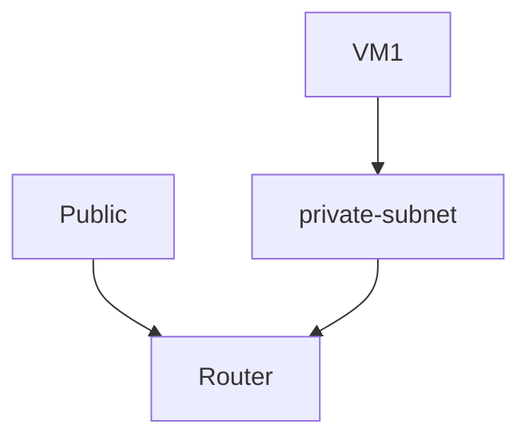
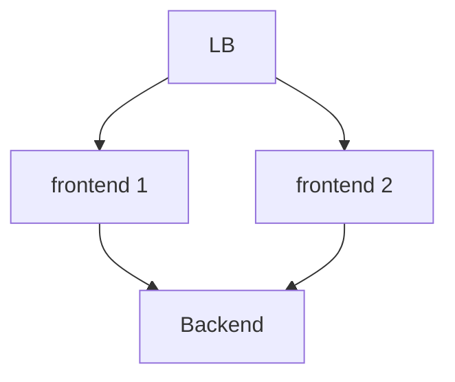

## TODO

### Create a project and user

url: https://horizon-openstack.apps.osp.do.intra/dashboard/auth/login/?next=/dashboard/project/

### boot vm + ssh
With GUI and CLI

We are going to install openstack cli

#### Install openstack cli

```bash
pip install python-openstackclient
```

#### Download the openrc file and source it

```
source openrc.sh
```

#### We connect to the cli with the following command

```bash
openstack --insecure
```

#### Create a network

```
network create my-private-network
```

**Result**
```
network create my-private-network
+---------------------------+--------------------------------------+
| Field                     | Value                                |
+---------------------------+--------------------------------------+
| admin_state_up            | UP                                   |
| availability_zone_hints   |                                      |
| availability_zones        |                                      |
| created_at                | 2024-12-17T14:27:05Z                 |
| description               |                                      |
| dns_domain                |                                      |
| id                        | 59ac0ea0-ff06-4378-8082-365399ad1c29 |
| ipv4_address_scope        | None                                 |
| ipv6_address_scope        | None                                 |
| is_default                | False                                |
| is_vlan_transparent       | None                                 |
| l2_adjacency              | True                                 |
| mtu                       | 1442                                 |
| name                      | my-private-network                   |
| port_security_enabled     | True                                 |
| project_id                | 536bdbf2605443aa87b37dd38a5ebd84     |
| provider:network_type     | None                                 |
| provider:physical_network | None                                 |
| provider:segmentation_id  | None                                 |
| qos_policy_id             | None                                 |
| revision_number           | 1                                    |
| router:external           | Internal                             |
| segments                  | None                                 |
| shared                    | False                                |
| status                    | ACTIVE                               |
| subnets                   |                                      |
| tags                      |                                      |
| updated_at                | 2024-12-17T14:27:05Z                 |
+---------------------------+--------------------------------------+
```

Here we also need to create a subnet in the network we just created

```bash
subnet create --network my-private-network --subnet-range 192.168.1.0/24 my-private-subnet
```

**Result**

```bash
(openstack) subnet create --network my-private-network --subnet-range 192.168.1.0/24 my-private-subnet
+----------------------+--------------------------------------+
| Field                | Value                                |
+----------------------+--------------------------------------+
| allocation_pools     | 192.168.1.2-192.168.1.254            |
| cidr                 | 192.168.1.0/24                       |
| created_at           | 2024-12-17T15:08:48Z                 |
| description          |                                      |
| dns_nameservers      |                                      |
| dns_publish_fixed_ip | None                                 |
| enable_dhcp          | True                                 |
| gateway_ip           | 192.168.1.1                          |
| host_routes          |                                      |
| id                   | 09c59b77-02f7-45f1-8bf7-d5c2e57b75ca |
| ip_version           | 4                                    |
| ipv6_address_mode    | None                                 |
| ipv6_ra_mode         | None                                 |
| name                 | my-private-subnet                    |
| network_id           | 59ac0ea0-ff06-4378-8082-365399ad1c29 |
| project_id           | 536bdbf2605443aa87b37dd38a5ebd84     |
| revision_number      | 0                                    |
| segment_id           | None                                 |
| service_types        |                                      |
| subnetpool_id        | None                                 |
| tags                 |                                      |
| updated_at           | 2024-12-17T15:08:48Z                 |
+----------------------+--------------------------------------+
```

#### Create a router

The router is used to connect the private network to the public network
allowing us to access the internet and connect to the VMs

The goal is to have the following network topology



```bash
router create my-router
```

After creating the router we need to connect it to the private network of the VMs

```bash
(openstack) network list

+--------------------------------------+--------------------+--------------------------------------+
| ID                                   | Name               | Subnets                              |
+--------------------------------------+--------------------+--------------------------------------+
| 59ac0ea0-ff06-4378-8082-365399ad1c29 | my-private-network | 09c59b77-02f7-45f1-8bf7-d5c2e57b75ca |
| fbef2fab-472b-4c35-8d1c-be6fa156b193 | public             | cb5a3e16-dca4-4323-8720-c9968d91a802 |
+--------------------------------------+--------------------+--------------------------------------+
```

here we see that the private network subnet is `09c59b77-02f7-45f1-8bf7-d5c2e57b75ca`

We then add the private network to the router

```bash
router add subnet my-router 09c59b77-02f7-45f1-8bf7-d5c2e57b75ca
```

We need to set the router gateway to the public network

```bash
router set --external-gateway public my-router
```

After that we will be able to add a [floating ip](#create-a-floating-ip) to the VMs


#### Create a security group

The security group is a set of rules that define the traffic that can go in and out of the VMs

```bash
security group create my-security-group
```

```bash
security group rule list
```
Here we see the rules

```bash
+--------------------------------------+-------------+-----------+-----------+------------+-----------+--------------------------------------+----------------------+--------------------------------------+
| ID                                   | IP Protocol | Ethertype | IP Range  | Port Range | Direction | Remote Security Group                | Remote Address Group | Security Group                       |
+--------------------------------------+-------------+-----------+-----------+------------+-----------+--------------------------------------+----------------------+--------------------------------------+
| 0240a693-6e41-4621-8d8e-affa09432d1c | None        | IPv4      | 0.0.0.0/0 |            | ingress   | 693d92d5-cac3-4cd7-b6c7-06e71d0a02c3 | None                 | 693d92d5-cac3-4cd7-b6c7-06e71d0a02c3 |
| 14fd900e-cedf-4865-acdf-2427be8f0c97 | None        | IPv4      | 0.0.0.0/0 |            | egress    | None                                 | None                 | 693d92d5-cac3-4cd7-b6c7-06e71d0a02c3 |
| 2dc882b7-b2d1-4e0d-bdeb-affe939449df | None        | IPv4      | 0.0.0.0/0 |            | egress    | None                                 | None                 | 2e9aa85b-f6c1-4268-ae4b-ffbe2ecf960c |
| 601080dc-4f18-481f-81e5-cbf5eccb95a7 | None        | IPv6      | ::/0      |            | ingress   | 693d92d5-cac3-4cd7-b6c7-06e71d0a02c3 | None                 | 693d92d5-cac3-4cd7-b6c7-06e71d0a02c3 |
| 98ae2aa9-ea97-48eb-b32b-a4b35341b172 | None        | IPv6      | ::/0      |            | egress    | None                                 | None                 | 693d92d5-cac3-4cd7-b6c7-06e71d0a02c3 |
| c71f1077-72ca-4786-bbaf-8486d59641b0 | None        | IPv6      | ::/0      |            | egress    | None                                 | None                 | 2e9aa85b-f6c1-4268-ae4b-ffbe2ecf960c |
+--------------------------------------+-------------+-----------+-----------+------------+-----------+--------------------------------------+----------------------+--------------------------------------+
```

```bash
security group rule create --proto tcp --dst-port 22 --ingress my-security-group
```

We can see the security group to see if the rule is part of the list

```bash
security group show my-security-group
```

#### We then create a keypair 

The keypair is used to ssh into the VMs

```bash
keypair create --publick-key ~/.ssh/id_rsa.pub my-key
```

#### We can see the flavor of the VMs

```bash
flavor list
```

```bash
(openstack) flavor list
+--------------------------------------+-----------+-------+------+-----------+-------+-----------+
| ID                                   | Name      |   RAM | Disk | Ephemeral | VCPUs | Is Public |
+--------------------------------------+-----------+-------+------+-----------+-------+-----------+
| 0bb896b0-3e44-47d9-b478-017ac1008498 | m1.large  | 16096 |   50 |         0 |     8 | True      |
| dddb3477-5d0c-4f11-9c27-3622f32cb5cb | m1.tiny   |   512 |    1 |         0 |     1 | True      |
| fa8d51d6-fde3-4f21-937f-52d5405f193c | m1.small  |  1024 |   10 |         0 |     2 | True      |
| fb6aeff8-367d-4856-ad93-2960a921da9f | m1.medium |  4096 |   50 |         0 |     4 | True      |
+--------------------------------------+-----------+-------+------+-----------+-------+-----------+
```

#### We can see the images available

```bash
image list
```

**Result**
```
(openstack) image list
+--------------------------------------+-----------+--------+
| ID                                   | Name      | Status |
+--------------------------------------+-----------+--------+
| 049ceb7e-b2c1-41fe-ab4d-83dc55f731b8 | CentOS-9  | active |
| 5e7a19ae-977f-4a04-ac2e-a7b79b7824db | Debian-12 | active |
| d2ff10f7-6468-4618-9412-6fbe7f73c056 | cirros    | active |
+--------------------------------------+-----------+--------+
```

#### We can then create a VM

```bash
server create --flavor m1.small --image Debian-12 --network my-private-network --security-group my-security-group --key-name my-key my-vm
```

#### Connect to my VM

```bash
openstack server show my-vm
```

#### Create a floating ip

A floating ip allows us to access the VM from the internet

```bash
floating ip create public

(openstack) floating ip list
+--------------------------------------+---------------------+------------------+------+--------------------------------------+----------------------------------+
| ID                                   | Floating IP Address | Fixed IP Address | Port | Floating Network                     | Project                          |
+--------------------------------------+---------------------+------------------+------+--------------------------------------+----------------------------------+
| 16193368-f2e4-40a6-ae3a-c3d03150c175 | 162.38.112.184      | None             | None | fbef2fab-472b-4c35-8d1c-be6fa156b193 | 536bdbf2605443aa87b37dd38a5ebd84 |
+--------------------------------------+---------------------+------------------+------+--------------------------------------+----------------------------------+
```

We then associate the floating ip to the VM

```bash
floating ip add
```

list the floating ips

```bash
floating ip list
```

We can now add the floating ip to the VM

```bash
server add floating ip b6fb0270-6042-4a4b-86e1-e0dd298218e8 16193368-f2e4-40a6-ae3a-c3d03150c175
```

We can then ssh into the VM

```bash
ssh -i ~/.ssh/id_rsa debian@162.38.112.184
```

### Deploy 3 VMs
Using terraform




### HEAT

Heat is an orchestration engine to launch multiple composite cloud applications based on templates in the form of text files that can be treated like code.

Simply put, Heat is a way to automate the deployment of resources in OpenStack.


```yaml
heat_template_version: 2015-10-15

description: Déploiement d'une VM connectée à un Load Balancer

# We set parameters to be able to pass values to the template
parameters:
  image:
    type: string
    default: Debian-12
    description: Image pour la VM

  flavor:
    type: string
    default: m1.small
    description: Flavor pour la VM

  key_name:
    type: string
    description: Nom de la paire de clés SSH

  network_name:
    type: string
    default: my-private-network
    description: Nom du réseau privé

  subnet_cidr:
    type: string
    default: 192.168.1.0/24
    description: CIDR du sous-réseau

# Creation of the ressources
resources:

  # We create a private network
  private_network:
    type: OS::Neutron::Net
    properties:
      name: { get_param: network_name }

  # then a subnet with the private network
  private_subnet:
    type: OS::Neutron::Subnet
    properties:
      network_id: { get_resource: private_network }
      cidr: { get_param: subnet_cidr }
      dns_nameservers:
        - 8.8.8.8

  # We create a security group with rules to allow SSH and HTTP
  security_group:
    type: OS::Neutron::SecurityGroup
    properties:
      name: vm-security-group
      rules:
        - protocol: tcp
          port_range_min: 22
          port_range_max: 22
          remote_ip_prefix: 0.0.0.0/0
        - protocol: tcp
          port_range_min: 80
          port_range_max: 80
          remote_ip_prefix: 0.0.0.0/0

  # We create a new vm with the parameters passed + we start an http server on it 
  vm_instance:
    type: OS::Nova::Server
    properties:
      name: my-vm
      flavor: { get_param: flavor }
      image: { get_param: image }
      key_name: { get_param: key_name }
      networks:
        - network: { get_resource: private_network }
      security_groups:
        - { get_resource: security_group }
      user_data: |
        #!/bin/bash
        apt-get update
        apt-get install -y apache2
        systemctl enable apache2
        systemctl start apache2

  # We create a lb by passing the private subnet
  load_balancer:
    type: OS::Octavia::LoadBalancer
    properties:
      vip_subnet_id: { get_resource: private_subnet }

  # We create a listener on the load balancer
  ## The listeners allow the load balancer to listen to incoming traffic 
  listener:
    type: OS::Octavia::Listener
    properties:
      loadbalancer_id: { get_resource: load_balancer }
      protocol: HTTP
      protocol_port: 80

  # We create a pool to manage the incoming traffic
  pool:
    type: OS::Octavia::Pool
    properties:
      listener_id: { get_resource: listener }
      protocol: HTTP
      lb_algorithm: ROUND_ROBIN

  # We create a pool member to add the vm to the pool
  pool_member:
    type: OS::Octavia::PoolMember
    properties:
      address: { get_attr: [vm_instance, first_address] }
      protocol_port: 80
      pool_id: { get_resource: pool }

# We output the vip address of the load balancer
outputs:
  lb_vip:
    description: Adresse IP du Load Balancer
    value: { get_attr: [load_balancer, vip_address] }
```


### Ansible


connais pas

### Deploy un kube cluster
