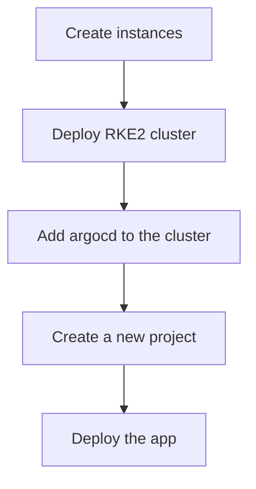
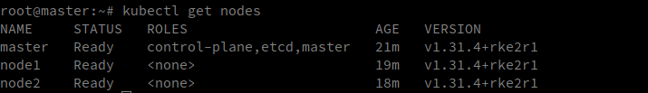

# Terraform TP

The goal here is to familiarize ourselves with Terraform to declare and manage infrastructure as code.

The deployed infrastructure will be a RKE2 cluster with a master and 2 workers nodes with an argocd application deployed on it.

## Prerequisites

- [Terraform](https://learn.hashicorp.com/tutorials/terraform/install-cli)


### Terraform

#### How to run it

```
source <openrc file>
cd terraform
terraform apply
```


This will take a long time go take a break ...

3 modules are created, to run the commands you need to go modify the compute.auto.tfvars.example file with your own values.

then terraform apply, make sure you sourced the openrc file before running the terraform commands.


Basically we are creating 3 instances then we are using cloud init ansible method to deploy the rke2 cluster on the 3 instances. Once the cluster is created we add argocd to the cluster, 
create a new project with the app we want to deploy, here [this one](https://github.com/thomas-mauran/kanas)







### Argocd

It is available on the master node port 30670

[here](https://162.38.112.24:30670/login?return_url=https%3A%2F%2F162.38.112.24%3A30670%2Fapplications)

The credentials are admin and the password you set in tf

### Ansible deploy a simple pod

Simple exercice to just deploy a vm in openstack (not tf related)

```bash
ansible-galaxy collection install openstack.cloud
```

to apply the ansible config

ansible-playbook -vvv ansible/ansible-create-os-instance/create_os_vm.yml   

### Heat

The heat file is available [here](./heat.yaml)